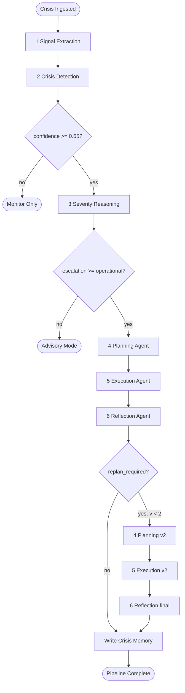
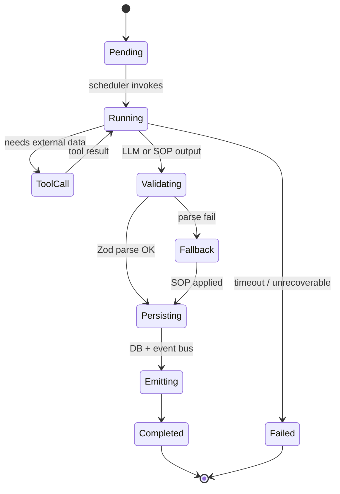
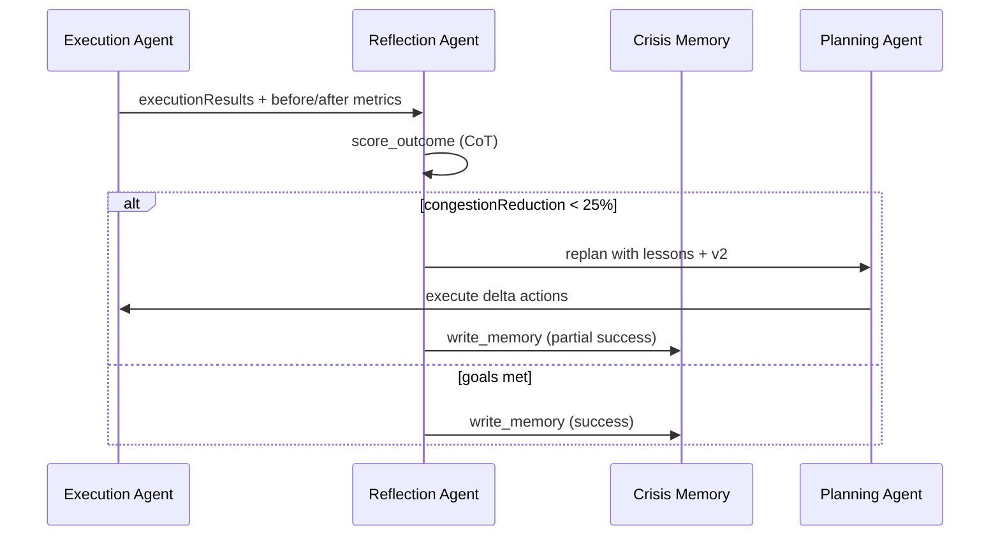

# CityBrain AI — Complete AI Orchestration Layer

> **Mission:** Autonomous emergency operations center — ingest chaos, reason with evidence, plan coordinated response, execute in simulation, reflect, and adapt.  
> **Patterns applied:** Chain-of-Thought (CoT), decision frameworks, tool-first agents (MCP-style), reflection loops, crisis memory.

---

## Executive Overview

```
┌─────────────────────────────────────────────────────────────────────────────┐
│                     ORCHESTRATION CONTROLLER                                 │
│  PipelineRunner · EscalationEngine · ConfidenceScorer · ReplanController    │
└───────────────────────────────────┬─────────────────────────────────────────┘
                                    │
         ┌──────────────────────────┼──────────────────────────┐
         ▼                          ▼                          ▼
┌─────────────────┐        ┌─────────────────┐        ┌─────────────────┐
│  SHARED STATE   │        │   EVENT BUS     │        │  TOOL REGISTRY  │
│ CrisisRunState  │        │ domain + WS     │        │ ≤16 tools       │
└────────┬────────┘        └────────┬────────┘        └────────┬────────┘
         │                          │                          │
    ┌────┴────┬────────┬────────┬───┴───┬────────┐            │
    ▼         ▼        ▼        ▼       ▼        ▼            ▼
  [1]Sig   [2]Det   [3]Sev   [4]Plan [5]Exec  [6]Refl    simulate_*
  Extract  Detect   Reason   +tools           +memory
```

**Six primary agents** (user-facing ops timeline). Planning and Execution **embed** resource allocation, traffic rerouting, and citizen alerts as **tool calls** inside phases 4–5 (not separate agents on the UI timeline).

---

## 1. Orchestration Flow

### Master pipeline (happy path)



### Phase timing (autonomous ops center feel)

| Phase | Agent | Typical duration | Visible to operator |
|-------|-------|------------------|---------------------|
| T+0s | Signal Extraction | 200–800ms | Signal ticker populates |
| T+1s | Crisis Detection | 300–1200ms | Crisis card appears |
| T+2s | Severity Reasoning | 400–1500ms | Escalation badge turns red |
| T+4s | Planning | 500–3000ms | Plan card + action list |
| T+8s | Execution | 1–5s | Execution theater logs |
| T+12s | Reflection | 300–1000ms | Replan banner or resolved |

Staggered `signal.ingested` events (400ms) sell the "live fusion" narrative.

### Commands that start the pipeline

| Trigger | Entry |
|---------|-------|
| `POST /demo/scenarios/:key/run` | Ingest scenario → auto-start |
| `POST /signals/ingest` + threshold | Auto-start if cluster confidence high |
| `POST /crises/:id/analyze` | Manual / re-run |

---

## 2. Agent Lifecycle

Every agent follows the same **OPS lifecycle**:



### Per-agent responsibilities

| # | Agent | Input | Output | CoT trigger |
|---|-------|-------|--------|-------------|
| 1 | **Signal Extraction** | `rawSignals[]` | `normalizedSignals[]` | Entity/geo parse steps |
| 2 | **Crisis Detection** | normalized + memory | `candidate` or abort | Fusion rationale |
| 3 | **Severity Reasoning** | candidate + weather/traffic | `severity`, escalation | Impact estimation steps |
| 4 | **Planning** | severity + SOP + memory | `plan`, resources, routes, alerts | Least-to-most sub-goals |
| 5 | **Execution** | approved plan | `executionResults`, snapshots | Pre/post state check |
| 6 | **Reflection** | results + goals | `reflection`, memory write | Outcome scoring steps |

### Agent prompt contract (Antigravity)

Each agent in [`antigravity/agents/`](../antigravity/agents/) defines:

```yaml
---
name: planning
tools: [load_sop, query_memory, allocate_units, google_routes, draft_alert]
risk: safe
outputs: [ResponsePlan, ResourceAssignment[], RouteOverride[], CitizenAlert[]]
cot: true
---
```

---

## 3. Inter-Agent Communication

Agents **do not** send messages to each other. Communication is **triangular**:

### A. Shared state (`CrisisRunState`)

```typescript
interface CrisisRunState {
  runId: string;
  crisisId: string;
  correlationId: string;
  planVersion: number;
  stepCount: number;
  maxSteps: number;

  rawSignals: Signal[];
  normalizedSignals: Signal[];
  candidate?: CrisisCandidate;
  severity?: SeverityReport;
  plan?: ResponsePlan;
  resources?: ResourceAssignment[];
  routes?: RouteOverride[];
  alerts?: CitizenAlert[];
  executionResults?: ExecutionResult[];
  reflection?: ReflectionReport;

  confidence: ConfidenceBundle;
  replanRequired: boolean;
  error?: string;
}
```

**Rule:** Agent N may only write fields it owns; reads any prior fields.

| Agent | Writes |
|-------|--------|
| Signal Extraction | `normalizedSignals` |
| Crisis Detection | `candidate`, `confidence.detection` |
| Severity Reasoning | `severity`, `confidence.severity` |
| Planning | `plan`, `resources`, `routes`, `alerts` |
| Execution | `executionResults` |
| Reflection | `reflection`, `replanRequired`, `confidence.outcome` |

### B. Event bus (async observers)

| Event | When | Consumers |
|-------|------|-----------|
| `agent.started` | Node begin | WS, metrics |
| `agent.completed` | Node end | WS, `reasoning_logs` writer |
| `tool.invoked` | Tool call | `execution_logs` |
| `escalation.changed` | Severity agent | WS, `escalation_history` |
| `pipeline.replan` | Reflection | WS, replan controller |

### C. Blackboard (optional v2)

`OrchestrationBlackboard` in Redis for multi-worker:

```
blackboard:{crisisId} → JSON snapshot of CrisisRunState
```

---

## 4. Reasoning Trace Architecture

### Layers (judge-visible)

```
┌─────────────────────────────────────────────────────────┐
│ L4  UI Timeline     agent.step WebSocket events         │
├─────────────────────────────────────────────────────────┤
│ L3  reasoning_logs  thought + evidence_refs + I/O JSON  │
├─────────────────────────────────────────────────────────┤
│ L2  domain_events   append-only event sourcing          │
├─────────────────────────────────────────────────────────┤
│ L1  execution_logs  tool-level audit                    │
└─────────────────────────────────────────────────────────┘
```

### Chain-of-Thought capture

Per agent, persist structured CoT (not raw chain only):

```typescript
interface ReasoningTrace {
  agentName: string;
  stepIndex: number;
  thought: string;           // Human-readable summary for UI
  cotSteps: string[];        // Optional explicit steps
  evidenceRefs: EvidenceRef[];
  inputSnapshot: unknown;
  outputSnapshot: unknown;
  model: string;
  latencyMs: number;
  confidence: number;
}

interface EvidenceRef {
  type: 'signal' | 'report' | 'memory' | 'weather' | 'traffic' | 'tool';
  id: string;
  excerpt: string;
}
```

### CoT prompt pattern (from chain-of-thought.md)

```text
You are the {AGENT_NAME} for CityBrain emergency operations.

Context:
{structured_state_json}

Let's think step by step:
1. What evidence do I have?
2. What is uncertain?
3. What decision do I make?
4. What is my confidence (0-1)?

Output JSON matching schema: {schema_name}
```

### Self-consistency (optional, severity + detection)

For `crisis_detection` and `severity_reasoning` only:

- Run 3 CoT samples at `temperature=0.4`
- Majority vote on `type` / `severity`
- `confidence = agreement_ratio`

MVP uses single pass + rules; enable with `SELF_CONSISTENCY=true`.

---

## 5. Memory Persistence

### Short-term (within run)

- `CrisisRunState` in process memory for pipeline duration
- Redis blackboard if multi-worker

### Long-term (across crises)

| Store | Content | Writer |
|-------|---------|--------|
| `crisis_memory` | summary, lessons, embedding, outcome_score | Reflection agent |
| `domain_events` | `ReflectionCompleted`, `CrisisResolved` | Event append |
| `escalation_history` | severity timeline | Severity agent |

### Memory read path (Planning + Detection)

```text
query_memory(crisis_type, area_label, top_k=3)
  → inject into prompt as "INSTITUTIONAL MEMORY"
```

Example injection:

```text
Similar past crisis (G-10 flood, 2024): reroute via IJP delayed 12min.
Prefer Murree Rd corridor. Outcome score: 0.72.
```

### Embedding pipeline (v2)

```text
Reflection → embed(summary + lessons) → crisis_memory.embedding
Planning/Detection → vector similarity search
```

---

## 6. Confidence Scoring

### Multi-factor bundle

```typescript
interface ConfidenceBundle {
  detection: number;    // 0-1 cluster fusion
  severity: number;     // 0-1 impact assessment
  plan: number;         // 0-1 SOP match + resource availability
  execution: number;    // 0-1 action success rate
  outcome: number;      // 0-1 reflection score
  overall: number;      // weighted composite
}
```

### Detection confidence formula

```
detection = clamp(
  0.35 * signal_density_score +
  0.25 * source_diversity_score +
  0.25 * geo_cluster_score +
  0.15 * memory_prior_score,
  0, 1
)

signal_density_score = min(1, unique_signals / 4)
source_diversity_score = unique_sources / 4
geo_cluster_score = 1 - (spread_km / 5)  // tight cluster = higher
```

### Severity confidence

- High if weather + traffic corroborate social reports
- Penalty if conflicting signals (e.g. heatwave vs flood)

### Overall (for UI badge)

```
overall = 0.3*detection + 0.3*severity + 0.2*plan + 0.2*outcome
```

Display: **91% CONFIDENCE** on crisis card when `detection >= 0.85`.

---

## 7. Adaptive Escalation Logic

Decision tree (inspired by procurement escalation frameworks):

```
START: detection.confidence >= 0.65?
├── NO  → status=monitoring, escalation=watch, STOP pipeline
└── YES → assess severity.level
          ├── low      → escalation=watch,     auto_plan=false
          ├── medium   → escalation=advisory,  auto_plan=false
          ├── high     → escalation=operational, auto_plan=true
          └── critical → escalation=critical,  auto_plan=true, parallel_notify=true
```

### Auto-execution gate

| Escalation | Behavior |
|------------|----------|
| `watch` | Log only, WS ticker |
| `advisory` | Draft plan, no execution until operator confirms (v2) |
| `operational` | **Autonomous** plan + execute (MVP demo) |
| `critical` | Autonomous + replan allowed + priority queue |

### Escalation mutations

Every transition → `escalation_history` row + `domain_events.EscalationChanged`.

---

## 8. Execution Tracking

### Planning → Execution handoff

```typescript
interface ExecutionManifest {
  crisisId: string;
  planVersion: number;
  actions: PlannedAction[];
  idempotencyPrefix: string;  // crisisId:planVersion
  snapshotBefore: CityMetrics;
}
```

### Per-action tracking

| Field | Purpose |
|-------|---------|
| `emergency_actions.status` | draft → executing → completed |
| `execution_logs` | tool request/response/state_delta |
| `traffic_updates` / `alerts` | Domain-specific outcome rows |

### Execution agent algorithm

```
1. snapshot BEFORE metrics
2. FOR each action in plan (priority ASC):
     a. idempotency check
     b. dispatch to ActionHandlerRegistry
     c. log execution_logs
     d. emit action.executed WS
3. snapshot AFTER metrics
4. compute deltas → state.executionResults
```

---

## 9. Retry / Failure Handling

### Agent-level

| Failure | Handling |
|---------|----------|
| Gemini timeout | Retry 2× → SOP fallback |
| Zod validation fail | SOP fallback, log warning |
| Tool throw | Retry tool 1× → partial result in log |
| Agent timeout 30s | Mark agent failed, abort pipeline |

### Tool-level (agent-tool-builder principles)

```typescript
// Never silent fail — always return string to LLM
{ success: false, error: "GEOCODE_FAILED", hint: "Used centroid fallback" }
```

### Pipeline-level

| Condition | Action |
|-----------|--------|
| Detection fail | Stop, crisis stays `detecting` |
| Planning fail | Use `SOP_TEMPLATES[crisis_type]` |
| Execution partial | Continue, reflection notes partial |
| Reflection replan | Max 1 replan (`planVersion <= 2`) |

### Replan controller

```typescript
function shouldReplan(reflection: ReflectionReport, state: CrisisRunState): boolean {
  if (state.planVersion >= 2) return false;
  if (reflection.metricsDelta.congestionReduction < 0.25) return true;
  if (reflection.metricsDelta.strandedReduction < 0.10) return true;
  return reflection.replanRequired; // agent explicit flag
}
```

Aligned with [`reflection.md`](../antigravity/agents/reflection.md).

---

## 10. Orchestration Code Structure

```
ai-agents/
├── orchestrator/
│   ├── src/
│   │   ├── index.ts                    # Public API: runPipeline()
│   │   ├── controller/
│   │   │   ├── pipeline-runner.ts      # Main loop
│   │   │   ├── replan-controller.ts
│   │   │   └── escalation-engine.ts
│   │   ├── state/
│   │   │   ├── crisis-run-state.ts
│   │   │   └── state-mutators.ts       # Per-agent write rules
│   │   ├── agents/
│   │   │   ├── agent.interface.ts
│   │   │   ├── agent-runner.ts         # CoT + validate + persist
│   │   │   ├── signal-extraction.agent.ts
│   │   │   ├── crisis-detection.agent.ts
│   │   │   ├── severity-reasoning.agent.ts
│   │   │   ├── planning.agent.ts
│   │   │   ├── execution.agent.ts
│   │   │   └── reflection.agent.ts
│   │   ├── confidence/
│   │   │   └── confidence-scorer.ts
│   │   ├── traces/
│   │   │   ├── trace-writer.ts         # reasoning_logs + domain_events
│   │   │   └── cot-builder.ts
│   │   ├── llm/
│   │   │   ├── gemini.client.ts
│   │   │   └── sop-fallback.ts
│   │   └── graph/
│   │       ├── pipeline-graph.ts       # Node order + gates
│   │       └── edges.ts
│   └── package.json
├── tools/                              # @citybrain/tools (existing)
└── prompts/                            # Symlink → antigravity/agents
```

### Core interfaces

```typescript
// agent.interface.ts
export interface CityBrainAgent {
  readonly name: AgentName;
  readonly tools: string[];
  run(ctx: AgentContext): Promise<AgentResult>;
}

export interface AgentContext {
  state: CrisisRunState;
  toolCtx: ToolContext;
  llm: LlmClient;
  memory: MemoryClient;
  trace: TraceWriter;
  emit: (event: DomainEvent) => void;
}

export interface AgentResult {
  thought: string;
  cotSteps?: string[];
  evidenceRefs: EvidenceRef[];
  confidence: number;
  patch: Partial<CrisisRunState>;
}
```

### Pipeline runner (pseudocode)

```typescript
export async function runPipeline(input: PipelineInput): Promise<CrisisRunState> {
  const state = initState(input);
  const graph = buildSixAgentGraph();

  for (const node of graph.nodes) {
    if (!graph.shouldRun(node, state)) continue;

    await trace.writeStarted(state, node.name);
    const result = await agentRunner.run(agents[node.name], { state, ...deps });
    stateMutators.apply(state, node.name, result.patch);
    state.confidence = confidenceScorer.update(state, node.name, result.confidence);
    await trace.writeCompleted(state, node.name, result);
    await emitAgentStep(state, node.name, result);

    if (graph.isTerminalEarly(node, state)) break;
  }

  if (replanController.shouldReplan(state)) {
    return runReplanPass(state, deps);
  }

  return state;
}
```

### Tool budget (agent-tool-builder)

**≤16 tools** across pipeline:

| Tool | Used by |
|------|---------|
| `parse_signal`, `geocode` | Signal Extraction |
| `cluster_signals`, `query_memory` | Crisis Detection |
| `get_weather`, `get_traffic` | Severity |
| `load_sop`, `allocate_units`, `google_routes`, `draft_alert` | Planning |
| `simulate_action`, `create_ticket` | Execution |
| `score_outcome`, `write_memory` | Reflection |

---

## Reflection Loop (expanded)

Per [`reflection.md`](../antigravity/agents/reflection.md):



**Reflection prompt (CoT):**

```text
Evaluate emergency response simulation results.

Step 1: Compare before/after congestion and stranded counts.
Step 2: Did each action achieve its state_delta goal?
Step 3: Identify remaining risks (e.g. secondary corridor overload).
Step 4: Decide: replan_required true/false.
Step 5: Extract lessons for crisis memory.

Output: ReflectionReport JSON.
```

---

## Antigravity Integration

| Artifact | Role |
|----------|------|
| `antigravity/workflows/citybrain-ciro.md` | Human workflow spec |
| `antigravity/agents/*.md` | Authoring source for prompts |
| `antigravity/traces/*.json` | Submission exports |
| Runtime `bridge.ts` | Load prompts; mirror trace schema |

**Lazy prompt loading:** max 2 agent bodies per LLM call (discovery-manifest pattern).

---

## Mapping: 6 UI Agents vs 9 Internal Capabilities

| UI Agent (timeline) | Internal capabilities |
|---------------------|----------------------|
| Signal Extraction | normalize, geocode, translate |
| Crisis Detection | cluster, memory query |
| Severity Reasoning | weather, traffic, escalation |
| Planning | SOP, allocate, reroute, alert draft |
| Execution | simulate all actions |
| Reflection | score, memory, replan |

---

*Version 1.0 — aligns with [`BACKEND_ARCHITECTURE.md`](./BACKEND_ARCHITECTURE.md), [`DATABASE_ARCHITECTURE.md`](./DATABASE_ARCHITECTURE.md), implementation in [`services/api/src/orchestrator/`](../services/api/src/orchestrator/).*
