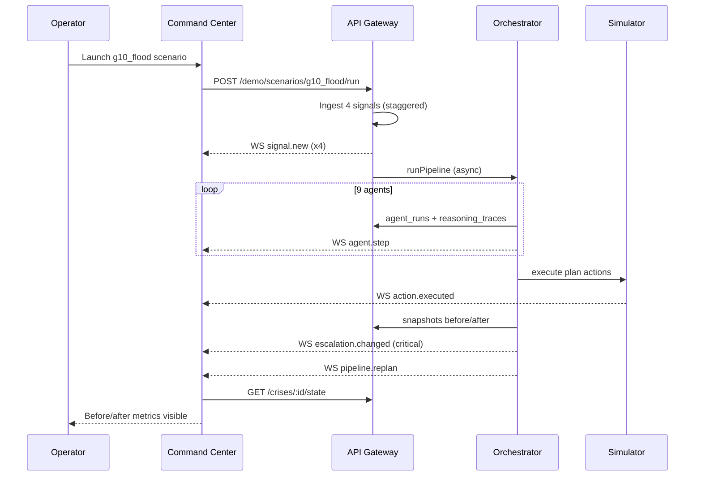
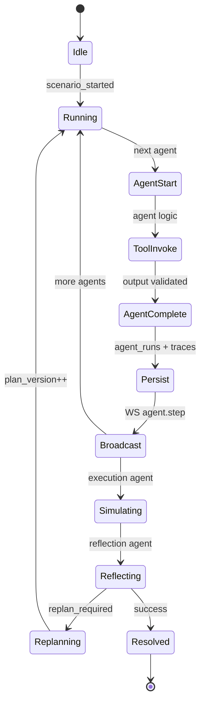
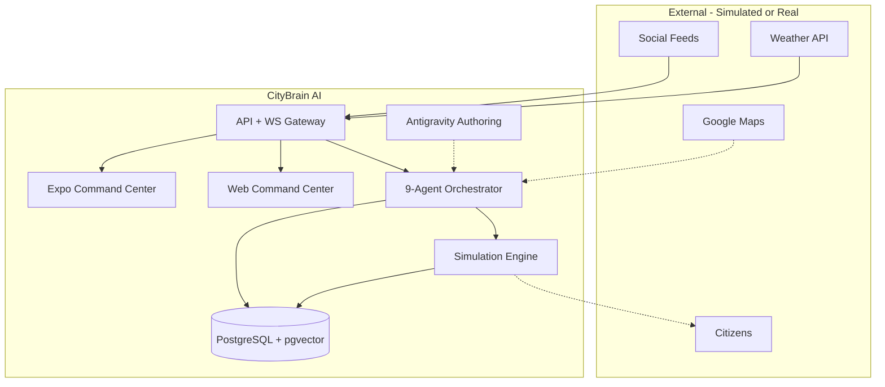

# CityBrain AI — Enterprise Architecture

> **Autonomous Crisis Intelligence & Emergency Response Orchestration**  
> Target: Google Antigravity Hackathon — Challenge 3 (CIRO)  
> Region: Islamabad smart-city demo  
> Design stance: *AI is autonomously managing a city emergency* — not a chatbot, not a passive dashboard.

---

## Understanding Lock

| Dimension | Definition |
|-----------|------------|
| **What** | Real-time multi-agent system that ingests crisis signals, reasons, plans, simulates coordinated response, reflects, and replans |
| **Why** | Fragmented city response is slow; signals exist but are not converted into action |
| **Who** | Emergency ops coordinators, city officials, hackathon judges (demo), citizens (alert recipients — simulated) |
| **Constraints** | Antigravity-central orchestration; mobile MUST; action simulation MUST; no real PII |
| **Non-goals** | Generic summarization app; weather-only widget; human-in-loop for every step in demo |

### Assumptions

- Demo scale: &lt;100 concurrent WebSocket clients, &lt;10k signals/day
- Gemini API available; SOP fallback when unavailable
- Google Maps for geospatial; mock/simulated external APIs acceptable
- Single-region deployment (Islamabad) for hackathon; architecture supports multi-city extension

### Decision Log

| Decision | Alternatives | Rationale |
|----------|--------------|-----------|
| Hybrid Antigravity + Node runtime | Antigravity-only; LangGraph-only | Judges need Antigravity traces; Node ensures reliable demo execution |
| Monorepo npm workspaces | Polyrepo | Shared types, single Docker build, hackathon velocity |
| PostgreSQL + pgvector | Pinecone-only; Redis-only memory | ACID for crisis state; vector recall in one store |
| Event-sourced agent traces | Logs only | Auditability, replay, judge-visible reasoning |
| WebSocket push + REST snapshot | Polling-only | Command-center “live ops” feel |

---

## 1. Complete Folder Structure

```
citybrain/
├── apps/
│   └── mobile/                          # Expo RN — primary deliverable (MUST)
│       ├── app/                         # expo-router screens
│       │   ├── _layout.tsx              # QueryClient + WS hook
│       │   ├── index.tsx                # Ops Overview
│       │   ├── demo.tsx                 # Scenario launcher
│       │   └── crisis/[id].tsx          # Dossier + trace + execution
│       ├── components/                  # Panel, CrisisMap, ...
│       ├── hooks/                       # useWebSocket
│       ├── lib/                         # api.ts, store.ts (Zustand)
│       └── global.css                   # NativeWind
│
├── services/
│   └── api/                             # Unified gateway + orchestrator + simulator
│       ├── src/
│       │   ├── index.ts                 # HTTP + WS bootstrap
│       │   ├── routes/                  # REST /api/v1
│       │   ├── ws/                      # WebSocket hub
│       │   ├── db/                      # pool, repository, migrate, seed
│       │   ├── orchestrator/            # graph.ts, gemini.ts
│       │   ├── simulator/               # engine.ts
│       │   ├── antigravity/             # bridge.ts — prompt loader
│       │   └── seed/                    # Islamabad scenarios
│       └── package.json
│
├── packages/
│   ├── shared/                          # Zod schemas, types, WsEvent contracts
│   └── agent-tools/                     # TOOL_REGISTRY — callable agent tools
│
├── infra/
│   ├── migrations/                      # 001_init.sql (pgvector)
│   ├── nginx.conf                       # web → api proxy
│   └── web-fallback/                    # Docker command-center UI
│
├── antigravity/                         # Authoring + submission artifacts
│   ├── workflows/citybrain-ciro.md
│   ├── agents/*.md                      # 9 agent SKILL prompts
│   └── traces/sample-g10-flood.json
│
├── seed/                                # Shared scenario definitions (reference)
├── docs/
│   ├── ARCHITECTURE.md                  # This document
│   └── DEMO_SCRIPT.md
│
├── docker-compose.yml                   # postgres + redis + api + web
├── Dockerfile                           # Multi-stage: api | web
├── package.json                         # npm workspaces root
└── README.md
```

**Future enterprise extensions** (not required for hackathon MVP):

```
services/
├── orchestrator/          # Extract when graph exceeds api bundle
├── ingest/                # Dedicated signal ingestion workers
└── notification/          # SMS/push adapters

packages/
├── event-bus/             # Redis Streams / NATS contracts
└── embeddings/            # Gemini embedding client
```

---

## 2. Frontend Architecture

### Stack

| Layer | Technology | Role |
|-------|------------|------|
| Runtime | Expo SDK 52 | Mobile + web export |
| Routing | expo-router | File-based screens |
| Styling | NativeWind (Tailwind) | Ops-center dark theme |
| Server state | TanStack React Query | REST cache, polling fallback |
| Client state | Zustand | Live WS buffers (signals, traces, escalation) |
| Maps | react-native-maps + Google (web: embed iframe) | Crisis centroid, layers |

### Layered UI Model

```
┌─────────────────────────────────────────────────────────┐
│  Presentation (Screens)                                  │
│  OpsOverview | CrisisDossier | DemoControl              │
├─────────────────────────────────────────────────────────┤
│  Components (Panel, CrisisMap, MetricBlock, TraceLine)  │
├─────────────────────────────────────────────────────────┤
│  State                                                    │
│  Zustand (ephemeral live) + React Query (REST snapshots) │
├─────────────────────────────────────────────────────────┤
│  Transport                                                │
│  fetchApi / postApi + useWebSocket                       │
└─────────────────────────────────────────────────────────┘
```

### Design tokens (command-center)

- Background: `#0B0F14`
- Panel: `#121820` / border `#1E2A38`
- Accent: `#00FFC6` (system active)
- Warn: `#FFB020` | Danger: `#FF3B5C`
- Typography: monospace for traces, system UI for narrative

### Data flow (frontend)

1. User launches scenario → `POST /demo/scenarios/:key/run`
2. WebSocket receives `signal.new` → Zustand signal ticker
3. `agent.step` events → trace timeline (live)
4. React Query polls `/crises/:id`, `/traces`, `/state` for dossier completeness
5. Before/after metrics from `/crises/:id/state`

---

## 3. Backend Architecture

### Service boundaries (current: modular monolith)

```
                    ┌──────────────────┐
                    │   API Gateway     │
                    │  Express + WS     │
                    └────────┬─────────┘
                             │
        ┌────────────────────┼────────────────────┐
        ▼                    ▼                    ▼
┌───────────────┐   ┌───────────────┐   ┌───────────────┐
│ Route Layer   │   │ Orchestrator  │   │  Simulator    │
│ REST /api/v1  │   │ 9-agent graph │   │ Action exec   │
└───────┬───────┘   └───────┬───────┘   └───────┬───────┘
        │                   │                   │
        └───────────────────┼───────────────────┘
                            ▼
                   ┌───────────────┐
                   │  Repository   │
                   │  PostgreSQL   │
                   └───────────────┘
```

### Responsibilities

| Module | Path | Duty |
|--------|------|------|
| **Gateway** | `index.ts`, `routes/` | HTTP, CORS, health, scenario trigger |
| **WS Hub** | `ws/hub.ts` | Fan-out typed events to all clients |
| **Orchestrator** | `orchestrator/graph.ts` | Agent pipeline, state machine, Gemini |
| **Simulator** | `simulator/engine.ts` | Deterministic action execution |
| **Repository** | `db/repository.ts` | Persistence, no ORM (raw SQL, hackathon-simple) |
| **Antigravity bridge** | `antigravity/bridge.ts` | Load SKILL prompts at runtime |

### Cross-cutting concerns

- **Idempotency**: scenario run creates one `crisis_id`; actions keyed by plan version
- **Observability**: every agent step → `agent_runs` + `reasoning_traces`; every tool → `execution_logs`
- **Resilience**: Gemini failure → SOP fallback in `buildCandidateFromScenario`, `buildSeverity`, `buildPlan`

---

## 4. AI Orchestration Architecture

### Dual-layer model

```
┌─────────────────────────────────────────────────────────────┐
│  AUTHORING LAYER — Google Antigravity IDE                    │
│  • Workflow: antigravity/workflows/citybrain-ciro.md         │
│  • Agent prompts: antigravity/agents/*.md                    │
│  • Exported traces for submission                            │
└───────────────────────────┬─────────────────────────────────┘
                            │ prompt packs + policy
                            ▼
┌─────────────────────────────────────────────────────────────┐
│  RUNTIME LAYER — Node Orchestrator                           │
│  • CrisisRunState (typed graph state)                        │
│  • Sequential agent pipeline + conditional edges             │
│  • Gemini 2.0 Flash (fast) / Pro (deep) when API key set     │
│  • Tool registry dispatch                                    │
└─────────────────────────────────────────────────────────────┘
```

### Models

| Agent phase | Preferred model | Fallback |
|-------------|-----------------|----------|
| Signal extraction, crisis detection | `gemini-2.0-flash` | Rule-based normalization |
| Severity, planning, reflection | `gemini-2.0-flash` / pro | SOP templates per crisis type |
| Tool execution | N/A (deterministic handlers) | Always local |

### Structured output

- Zod schemas in `@citybrain/shared` define agent I/O contracts
- Gemini `responseMimeType: application/json` when available
- Invalid JSON → retain last valid SOP state; never crash pipeline

### Guardrails

- `maxSteps: 24` on `CrisisRunState`
- Per-agent timeout: 30s (enterprise target; MVP uses sync completion)
- No crisis detected → pipeline exits after `crisis_detection`

---

## 5. Agent Communication Flow

Agents do **not** message each other directly. Communication is **shared-state**:

```
┌──────────────┐     read/write      ┌─────────────────────┐
│   Agent N    │ ◄─────────────────► │   CrisisRunState    │
└──────────────┘                     │  • normalizedSignals│
       │                             │  • candidate        │
       │ tool calls                  │  • severity         │
       ▼                             │  • plan             │
┌──────────────┐                     │  • resources        │
│ Tool Registry│                     │  • routes, alerts   │
└──────────────┘                     │  • executionResults │
                                     │  • reflection       │
                                     └─────────────────────┘
```

### Pipeline order

```
signal_extraction → crisis_detection → severity_reasoning → planning
    → resource_allocation → [traffic_rerouting?] → citizen_alert
    → execution → reflection → [replan → planning → execution → reflection]
```

### Conditional routing

| Condition | Branch |
|-----------|--------|
| `candidate == null` after detection | **STOP** |
| `needsRouting(type)` flood/accident/blockage | traffic_rerouting |
| else | skip to citizen_alert |
| `reflection.replanRequired && planVersion < 2` | re-enter planning + execution + reflection |

### Side-channel: observability

Each agent completion emits:
1. DB: `agent_runs` + `reasoning_traces`
2. WS: `agent.step` { status: completed, thought, latencyMs }
3. Optional: Antigravity-export-compatible JSON (submission)

---

## 6. WebSocket Event Architecture

### Transport

- Path: `/ws`
- Protocol: JSON messages, no binary frames in MVP
- Pattern: broadcast to all connected clients (ops room model)

### Event catalog

| Event | Emitter | Payload | UI effect |
|-------|---------|---------|-----------|
| `signal.new` | Ingest / scenario | Signal + id | Ticker append |
| `crisis.updated` | Repo update | status, title, dossier | Crisis card refresh |
| `agent.step` | Orchestrator | agent, status, thought, latencyMs | Trace timeline |
| `action.executed` | Simulator | actionId, tool, stateDelta | Execution theater |
| `map.delta` | Rerouting agent | routes[] | Map polyline update |
| `escalation.changed` | Severity agent | level | Header badge |
| `pipeline.complete` | Graph end | crisisId | Enable dossier poll |
| `pipeline.replan` | Reflection | reason | Replan banner |

### Message envelope

```typescript
interface WsEvent<T> {
  type: WsEventType;
  crisisId?: string;
  timestamp: string;  // ISO-8601
  payload: T;
}
```

### Subscription model (enterprise)

- MVP: global broadcast
- v2: `SUBSCRIBE crisisId` frame; hub routes by room
- v2: Redis pub/sub for horizontal API scaling

---

## 7. Database Schema

### Entity-relationship (core)

```
signals ─────┬──── crisis_signals ──── crises
             │                           │
             │                    ┌──────┴──────┬──────────────┐
             │                    ▼             ▼              ▼
             │              agent_runs   response_plans   city_state_snapshots
             │                    │             │
             │                    ▼             ▼
             │            reasoning_traces   actions ── execution_logs
             │                                        │
             └──────────────────────────────── crisis_memory
```

### Tables (implemented)

| Table | Purpose |
|-------|---------|
| `signals` | Raw + normalized ingest |
| `crises` | Active incident record, dossier_json |
| `crisis_signals` | M:N signal ↔ crisis |
| `agent_runs` | Per-agent output, model, latency |
| `reasoning_traces` | Thought + evidence per run |
| `response_plans` | Versioned plans |
| `actions` | Planned/executed actions |
| `execution_logs` | Tool audit trail |
| `city_state_snapshots` | before/after metrics + map state |
| `crisis_memory` | Long-term lessons + embedding |
| `resources` | Ambulance, pump, tow, shelter inventory |
| `alerts` | Citizen alert records |
| `route_overrides` | Simulated traffic changes |

### Indexes (implemented + recommended)

- `signals(ingested_at DESC)`
- `crises(status, created_at DESC)`
- `agent_runs(crisis_id, created_at)`
- `execution_logs(crisis_id, created_at)`
- **v2**: HNSW on `crisis_memory.embedding`

---

## 8. Crisis Memory System

### Purpose

Recall similar past crises to inform detection, planning, and reflection — *institutional memory for the city*.

### Storage

```sql
crisis_memory (
  id, crisis_id, summary, crisis_type, area_label,
  outcome_score, lessons JSONB,
  embedding vector(384)  -- pgvector
)
```

### Lifecycle

```
Reflection Agent
    │
    ├─► score_outcome (metrics vs goals)
    ├─► write_memory (persist summary + lessons)
    └─► embed(summary) → crisis_memory.embedding  [v2]

Planning / Detection Agent
    │
    └─► query_memory(crisis_type, area) → top-k similar incidents
```

### Retrieval (MVP vs enterprise)

| MVP | Enterprise |
|-----|------------|
| `query_memory` returns static exemplar | Gemini `text-embedding-004` + cosine search |
| Keyword/type filter | Hybrid: vector + metadata (area, type, season) |
| Single hardcoded G-10 2024 example | Rolling window of all resolved crises |

### Memory-informed planning

- Planner receives: `{ matches: [{ summary, outcomeScore, lessons }] }`
- Prompt: *"Previous G-10 flood: reroute via IJP delayed 12min — prefer Murree Rd"*
- Visible in UI: **Memory Vault** screen (React Query → `GET /memory`)

---

## 9. Simulation Engine

### Principles

1. **Deterministic** — same inputs → same state deltas (judge-repeatable)
2. **Logged** — every action → `execution_logs`
3. **Idempotent** — action_id prevents double-apply
4. **Visible** — WS `action.executed` + map/metrics update

### Action handlers

| Action type | Simulator behavior | state_delta |
|-------------|-------------------|-------------|
| `traffic_reroute` | `google_routes` + `route_overrides` row | congestionDelta, route name |
| `dispatch_emergency` | `create_ticket` | ticketId, unit |
| `citizen_alert` | `alerts` row + reach count | reach |
| `deploy_pumps` | Resource dispatch sim | pumpsDeployed |
| `heat_shelter_open` | Shelter occupancy | sheltersOpen, occupancy |
| `infrastructure_isolate` | Grid segment off | segmentIsolated |

### Before/after snapshots

```
Execution Agent (pre)  → createSnapshot('before', metrics, mapState)
Execution Agent (post) → runSimulation(actions)
Reflection Agent       → createSnapshot('after', ...)
```

Metrics: `congestionIndex`, `strandedVehicles`, `activeAlerts`, `resourcesDeployed`

### Google Maps integration (enterprise)

- MVP: static embed / mock ETA delta
- v2: Routes API v2 for real `congestionDelta`; persist polyline in `route_overrides.polyline_json`

---

## 10. Real-Time Event Pipeline

```
┌─────────────┐    ┌─────────────┐    ┌──────────────┐    ┌─────────────┐
│  Sources    │───►│  Ingest API │───►│  PostgreSQL  │───►│ Orchestrator│
│ social,wx,  │    │ POST /signals│    │  signals     │    │  (async)    │
│ traffic     │    └──────┬──────┘    └──────────────┘    └──────┬──────┘
└─────────────┘           │                                        │
                          │ signal.new                           │ agent.*, action.*
                          ▼                                        ▼
                   ┌─────────────┐                         ┌─────────────┐
                   │  WS Hub     │◄────────────────────────│  broadcast  │
                   └──────┬──────┘                         └─────────────┘
                          │
              ┌───────────┼───────────┐
              ▼           ▼           ▼
         Mobile App   Web UI     [v2: SIEM]
```

### Latency targets

| Stage | Target |
|-------|--------|
| Signal ingest → WS | &lt; 100ms |
| Agent step → WS | &lt; 50ms after completion |
| Full pipeline (9 agents) | &lt; 15s (demo); &lt; 60s (with Gemini) |

### Enterprise: Redis Streams

```
ingest → stream:signals → worker → stream:crisis → orchestrator → stream:events → WS bridge
```

Enables replay, backpressure, multi-instance API.

---

## 11. API Architecture

### Base URL

`/api/v1`

### REST endpoints

| Method | Path | Description |
|--------|------|-------------|
| GET | `/health` | Liveness |
| GET | `/crises` | List active crises |
| GET | `/crises/:id` | Dossier + linked signals |
| GET | `/crises/:id/traces` | Agent runs + reasoning |
| GET | `/crises/:id/executions` | Execution log |
| GET | `/crises/:id/state` | Before/after snapshots |
| POST | `/signals/ingest` | Batch signal ingest |
| POST | `/crises/:id/analyze` | Start/continue pipeline |
| POST | `/demo/scenarios/:key/run` | One-click Islamabad demo |
| GET | `/memory` | Crisis memory recall |
| GET | `/resources` | Available units |

### Error model (enterprise)

```json
{ "error": { "code": "CRISIS_NOT_FOUND", "message": "...", "traceId": "uuid" } }
```

### Auth (enterprise, not MVP)

- Demo: open CORS
- Production: JWT + role `operator` | `viewer` | `system`

---

## 12. Mobile App Screens

| Screen | Route | Primary data |
|--------|-------|--------------|
| **Ops Overview** | `/` | `GET /crises`, WS signals/traces, escalation |
| **Demo Control** | `/demo` | `POST /demo/scenarios/:key/run` |
| **Crisis Dossier** | `/crisis/[id]` | crisis, traces, executions, state |
| **Intelligence Dossier** | (section in dossier) | summary, severity, multilingual quotes |
| **Agent Trace** | (section) | `GET .../traces` + live WS |
| **Execution Theater** | (section) | `GET .../executions` |
| **Before/After** | (section) | `GET .../state` |
| **Crisis Map** | (section) | centroid, routes, resources |
| **Memory Vault** | `/memory` [v2] | `GET /memory` |

### Navigation flow

```
Ops Overview ──► Demo Control ──► (auto) Crisis Dossier
     │                                    │
     └──────── tap crisis card ───────────┘
```

---

## 13. Dashboard Flow

### Operator journey (autonomous emergency)



### Escalation ladder (autonomous)

| Level | Trigger | System behavior |
|-------|---------|-----------------|
| `watch` | Low confidence | Monitor only |
| `advisory` | Medium severity | Prepare alerts |
| `operational` | High severity | Full pipeline auto-run |
| `critical` | Flood, grid failure | Immediate execution + replan eligible |

---

## 14. Agent Execution Lifecycle



### Per-agent lifecycle

1. **START** — `onAgentStep({ status: 'started' })`, WS emit
2. **EXECUTE** — run agent function; optional Gemini call
3. **TOOL** — invoke `TOOL_REGISTRY` handlers; log to `execution_logs`
4. **VALIDATE** — Zod parse output; SOP fallback on failure
5. **PERSIST** — `createAgentRun` + `reasoning_traces`
6. **COMPLETE** — WS emit with thought + latency
7. **BRANCH** — conditional edge evaluation

---

## 15. Reflection Loop Architecture

### Purpose

Close the autonomy loop: *measure simulated outcome → decide if plan worked → replan or resolve → write memory*.

### Flow

```
Execution Results
        │
        ▼
┌───────────────────┐
│  score_outcome    │  congestionReduction, strandedReduction
└─────────┬─────────┘
          ▼
┌───────────────────┐
│  Threshold check  │  replan if reduction < 25% OR g10_flood demo flag
└─────────┬─────────┘
          │
    ┌─────┴─────┐
    ▼           ▼
 replan      resolve
    │           │
    ▼           ▼
 planning    write_memory
 execution   status=resolved
 reflection
 (2nd pass)
```

### Replan context passed to planner

- `planVersion` incremented
- Prior `plan`, `reflection.lessons`, `reflection.summary`
- UI shows **pipeline.replan** event with reason

### Demo narrative (G-10 flood)

> *"Primary reroute reduced main corridor congestion. Kashmir Hwy still overloaded — initiating adaptive replan."*

Judges see: reflection agent → replan banner → second planning cycle in traces.

---

## System Context Diagram



---

## Non-Functional Requirements

| NFR | Target |
|-----|--------|
| Availability | 99% demo uptime; single-instance OK |
| Pipeline reliability | 100% completion with SOP fallback |
| Auditability | Full agent + execution trace per crisis |
| Security | No PII; secrets in env; SQL parameterized |
| Scalability path | Redis pub/sub, orchestrator workers, read replicas |

---

## Anti-Patterns (avoid)

- **Chatbot UX** — no free-text primary interface for ops
- **Dashboard-only** — must show autonomous agent progression
- **Black-box AI** — every decision has thought + evidence in traces
- **Non-deterministic demo** — random mocks break judge replay
- **Antigravity as sticker** — workflow + traces must be central

---

## Implementation Status (MVP)

| Component | Status |
|-----------|--------|
| Monorepo + Docker | ✅ |
| 9-agent pipeline + replan | ✅ |
| PostgreSQL schema | ✅ |
| WebSocket events | ✅ |
| 5 Islamabad scenarios | ✅ |
| Expo mobile screens | ✅ |
| Antigravity artifacts | ✅ |
| pgvector embeddings | Schema only; retrieval MVP static |
| Redis event bus | Compose only; not wired |
| Dedicated orchestrator service | Merged in api |

---

*Document version: 1.0 — aligned with `citybrain/` implementation and CIRO Challenge 3.*
