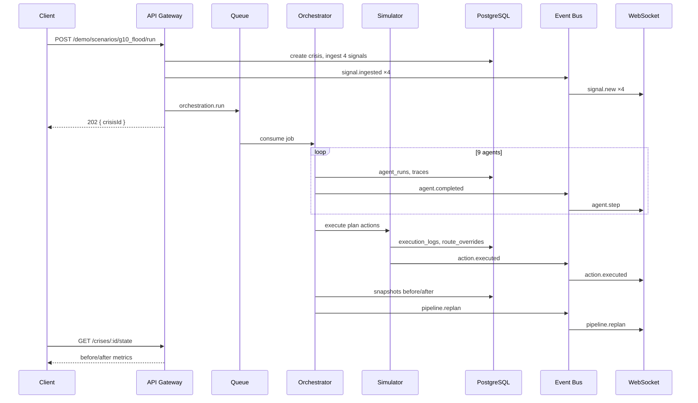

# CityBrain AI — Node.js Backend Architecture

> **Stack:** Express.js · WebSockets · PostgreSQL (pgvector) · Redis (event bus + queues)  
> **Pattern:** Modular monolith → event-driven → extractable microservices  
> **Aligned with:** `@backend-architect` — resilience, observability, clear boundaries

---

## Executive Summary

The CityBrain backend ingests multilingual crisis signals, runs a **9-agent AI orchestration pipeline**, simulates emergency response actions, reflects on outcomes, and pushes **real-time updates** to command-center clients. It is designed as a **modular monolith** with an internal event bus so the hackathon MVP runs on one process while production can split workers without rewriting domain logic.

```
┌──────────────┐     HTTP/WS      ┌─────────────────────────────────────────┐
│   Clients    │◄───────────────►│           API Gateway (Express)          │
│ mobile / web │                 │  middleware → routes → services          │
└──────────────┘                 └───────────────┬─────────────────────────┘
                                                 │
                    ┌────────────────────────────┼────────────────────────────┐
                    ▼                            ▼                            ▼
            ┌───────────────┐           ┌───────────────┐           ┌───────────────┐
            │  Event Bus    │           │ Orchestration │           │  Simulation   │
            │ Redis Streams │◄─────────►│  9-agent graph│──────────►│    Engine     │
            └───────┬───────┘           └───────┬───────┘           └───────┬───────┘
                    │                           │                           │
                    └───────────────────────────┼───────────────────────────┘
                                                ▼
                                       ┌───────────────┐
                                       │  PostgreSQL   │
                                       └───────────────┘
```

---

## 1. Folder Structure

```
backend/
├── api-gateway/                          # HTTP + WebSocket entry (Express)
│   ├── src/
│   │   ├── index.ts                      # Bootstrap, graceful shutdown
│   │   ├── app.ts                        # Express app factory
│   │   ├── config/
│   │   │   ├── env.ts                    # Zod-validated env
│   │   │   └── cors.ts
│   │   ├── middleware/
│   │   │   ├── request-id.middleware.ts
│   │   │   ├── error-handler.middleware.ts
│   │   │   ├── validate.middleware.ts
│   │   │   └── rate-limit.middleware.ts
│   │   ├── routes/
│   │   │   ├── index.ts                  # Route aggregator
│   │   │   ├── health.routes.ts
│   │   │   ├── signals.routes.ts
│   │   │   ├── crises.routes.ts
│   │   │   ├── demo.routes.ts
│   │   │   ├── memory.routes.ts
│   │   │   └── resources.routes.ts
│   │   └── websocket/
│   │       ├── ws-server.ts              # attach to http.Server
│   │       ├── connection-manager.ts
│   │       ├── subscription-registry.ts  # crisis rooms (v2)
│   │       └── ws-broadcaster.ts         # bridge from event bus
│   └── package.json
│
├── core/                                 # Domain services (framework-agnostic)
│   ├── src/
│   │   ├── features/
│   │   │   ├── ingestion/
│   │   │   │   ├── signal-ingest.service.ts
│   │   │   │   └── signal-normalizer.service.ts
│   │   │   ├── crisis/
│   │   │   │   ├── crisis.service.ts
│   │   │   │   ├── crisis.repository.ts
│   │   │   │   └── escalation.service.ts
│   │   │   ├── events/
│   │   │   │   ├── event-processor.service.ts
│   │   │   │   └── event-publisher.service.ts
│   │   │   ├── dispatch/
│   │   │   │   └── emergency-dispatch.service.ts
│   │   │   ├── traffic/
│   │   │   │   └── reroute.service.ts
│   │   │   ├── alerts/
│   │   │   │   └── citizen-alert.service.ts
│   │   │   ├── reflection/
│   │   │   │   └── reflection.service.ts
│   │   │   └── dashboard/
│   │   │       └── live-state.service.ts
│   │   └── index.ts
│   └── package.json
│
├── orchestration/                        # AI agent layer (wraps ai-agents pkg)
│   ├── src/
│   │   ├── pipeline-runner.service.ts
│   │   ├── pipeline-queue.consumer.ts
│   │   └── pipeline-events.emitter.ts
│   └── package.json
│
├── workers/                              # Queue consumers (separate process in prod)
│   ├── src/
│   │   ├── ingestion.worker.ts
│   │   ├── orchestration.worker.ts
│   │   ├── simulation.worker.ts
│   │   └── reflection.worker.ts
│   └── package.json
│
├── database/
│   ├── migrations/
│   ├── seeds/
│   └── src/
│       ├── pool.ts
│       └── migrate.ts
│
├── infrastructure/                       # Cross-cutting platform code
│   ├── event-bus/
│   │   ├── event-bus.interface.ts
│   │   ├── redis-stream.bus.ts           # production
│   │   └── in-memory.bus.ts              # dev / single-instance MVP
│   ├── queue/
│   │   ├── queue.interface.ts
│   │   ├── bullmq.queue.ts               # production
│   │   └── inline.queue.ts               # MVP: sync in-process
│   ├── logging/
│   │   ├── logger.ts                     # pino structured
│   │   └── correlation.ts
│   └── resilience/
│       ├── retry.policy.ts
│       ├── circuit-breaker.ts
│       └── idempotency.store.ts
│
└── README.md
```

### MVP vs target mapping (current repo)

| Target | Current (`services/api/src/`) |
|--------|--------------------------------|
| `api-gateway/` | `index.ts`, `routes/`, `ws/` |
| `core/features/*` | `db/repository.ts` + route handlers (to extract) |
| `orchestration/` | `orchestrator/graph.ts` |
| Simulation | `simulator/engine.ts` |
| `database/` | `db/`, `infra/migrations/` |

---

## 2. Backend Architecture

### Layered model (Clean Architecture)

| Layer | Responsibility | Depends on |
|-------|----------------|------------|
| **API Gateway** | HTTP/WS, validation, auth (v2), rate limits | Services, Event publisher |
| **Application services** | Use cases: ingest, trigger pipeline, get dossier | Repositories, Event bus, Orchestrator |
| **Domain** | Crisis, Signal, Plan, Escalation rules | `shared` types only |
| **Infrastructure** | PG, Redis, Gemini client, Google Routes | External systems |
| **Orchestration** | Agent graph execution | Tools, Simulator, LLM |

### Request paths

**Synchronous (read):**
```
GET /crises/:id → CrisisService → CrisisRepository → PostgreSQL
```

**Asynchronous (write / heavy):**
```
POST /demo/scenarios/:key/run
  → DemoService creates crisis + enqueues signals
  → EventBus: signal.ingested (×N)
  → Queue: orchestration.run { crisisId }
  → Worker: PipelineRunner
  → EventBus: agent.*, action.*, pipeline.*
  → WsBroadcaster → clients
```

### Modular services map

| Service | Feature |
|---------|---------|
| `SignalIngestService` | Crisis ingestion pipeline |
| `EventProcessorService` | Normalize, dedupe, route events |
| `CrisisService` | Crisis lifecycle CRUD |
| `PipelineRunnerService` | AI agent orchestration |
| `EmergencyDispatchService` | Dispatch simulation |
| `RerouteService` | Traffic rerouting simulation |
| `CitizenAlertService` | Alert drafting + delivery sim |
| `ReflectionService` | Outcome scoring + replan decision |
| `LiveStateService` | Dashboard snapshots + WS fan-out |

---

## 3. Middleware Flow

```
Incoming Request
       │
       ▼
┌──────────────────┐
│ request-id       │  X-Request-Id / traceId on req + res + logs
└────────┬─────────┘
         ▼
┌──────────────────┐
│ cors             │  Expo dev + web command center origins
└────────┬─────────┘
         ▼
┌──────────────────┐
│ json parser      │  express.json({ limit: '1mb' })
└────────┬─────────┘
         ▼
┌──────────────────┐
│ rate-limit       │  /signals/ingest, /demo/* stricter
└────────┬─────────┘
         ▼
┌──────────────────┐
│ validate         │  Zod schemas from @citybrain/shared
└────────┬─────────┘
         ▼
┌──────────────────┐
│ route handler    │  thin — delegates to service
└────────┬─────────┘
         ▼
┌──────────────────┐
│ error-handler    │  ApiError → JSON { code, message, traceId }
└──────────────────┘
```

### Middleware implementation sketch

```typescript
// request-id.middleware.ts
export function requestId(req, res, next) {
  const id = req.headers['x-request-id'] ?? crypto.randomUUID();
  req.requestId = id;
  res.setHeader('X-Request-Id', id);
  next();
}

// error-handler.middleware.ts — always last
export function errorHandler(err, req, res, _next) {
  logger.error({ err, requestId: req.requestId }, 'request failed');
  const status = err.statusCode ?? 500;
  res.status(status).json({
    error: { code: err.code ?? 'INTERNAL_ERROR', message: err.message, traceId: req.requestId },
  });
}
```

---

## 4. Event Bus Design

### Purpose

Decouple **ingestion**, **orchestration**, **simulation**, and **real-time UI** so each can scale, retry, and fail independently.

### Technology

| Environment | Implementation |
|-------------|----------------|
| MVP (single process) | `InMemoryEventBus` + direct `broadcast()` |
| Production | **Redis Streams** pub/sub + consumer groups |

### Event taxonomy (domain events)

| Event | Producer | Consumers |
|-------|----------|-----------|
| `signal.ingested` | Ingestion | Event processor, WS |
| `crisis.created` | Crisis service | WS, orchestration (optional) |
| `crisis.updated` | Crisis service | WS, dashboard |
| `orchestration.requested` | API / demo | Orchestration worker |
| `agent.started` | Orchestrator | WS, logs |
| `agent.completed` | Orchestrator | WS, DB persistence |
| `action.executed` | Simulator | WS, execution log |
| `escalation.changed` | Severity agent | WS |
| `map.delta` | Reroute service | WS |
| `pipeline.completed` | Orchestrator | WS, reflection queue |
| `pipeline.replan` | Reflection | WS, orchestration queue |
| `reflection.completed` | Reflection | Memory service, WS |

### Envelope (all bus events)

```typescript
interface DomainEvent<T = unknown> {
  id: string;              // UUID — idempotency key
  type: string;            // e.g. 'agent.completed'
  aggregateId: string;     // crisisId
  timestamp: string;       // ISO-8601
  correlationId: string;   // request / pipeline run
  payload: T;
  metadata?: { source: string; version: number };
}
```

### Redis Streams layout (production)

```
Stream: citybrain:events
Consumer groups:
  - orchestration-workers
  - ws-broadcaster
  - audit-logger

Stream: citybrain:commands
  - orchestration.run
  - simulation.execute
  - reflection.evaluate
```

### In-memory bus (MVP — current pattern)

```typescript
class InMemoryEventBus implements EventBus {
  private handlers = new Map<string, Set<Handler>>();

  publish(event: DomainEvent) {
    this.handlers.get(event.type)?.forEach(h => h(event));
    this.handlers.get('*')?.forEach(h => h(event)); // WS bridge
  }

  subscribe(type: string, handler: Handler) { ... }
}
```

---

## 5. WebSocket Implementation Strategy

### Transport

- **Path:** `/ws`
- **Library:** `ws` on shared `http.Server` (same port as REST)
- **Format:** JSON text frames

### Connection lifecycle

```
Client connect
    → send { type: 'connected', payload: { message } }
    → [v2] client sends { type: 'subscribe', crisisId }
Server event
    → WsBroadcaster filters by subscription (v2) or broadcast all (MVP)
Client disconnect
    → remove from ConnectionManager
```

### Scaling strategy

| Phase | Approach |
|-------|----------|
| MVP | In-process `Set<WebSocket>` + `broadcast()` |
| Multi-instance | Redis pub/sub channel `citybrain:ws` — each API node subscribes and fans out locally |
| Sticky sessions | Load balancer IP hash for WS upgrade |

### WS ↔ Event bus bridge

```typescript
// ws-broadcaster.ts
eventBus.subscribe('*', (event) => {
  const wsEvent = toWsEnvelope(event); // maps DomainEvent → WsEvent
  connectionManager.broadcast(wsEvent, { crisisId: event.aggregateId });
});
```

### Heartbeat

- Server ping every 30s; terminate if no pong (detect dead clients)
- Client reconnect with exponential backoff (frontend responsibility)

### Backpressure

- If client buffer full (`ws.bufferedAmount`), drop non-critical events (`signal.new`) before `agent.step`

---

## 6. API Endpoints

Base: `/api/v1`

### Health & meta

| Method | Path | Description |
|--------|------|-------------|
| GET | `/health` | Liveness + version |
| GET | `/ready` | Readiness (DB + Redis ping) |

### Signals & ingestion

| Method | Path | Description |
|--------|------|-------------|
| POST | `/signals/ingest` | Batch ingest raw signals → queue normalize |
| GET | `/signals` | List recent signals (filter: source, area) |

### Crises

| Method | Path | Description |
|--------|------|-------------|
| GET | `/crises` | List crises (status, escalation filters) |
| GET | `/crises/:id` | Full dossier + linked signals |
| POST | `/crises/:id/analyze` | Enqueue orchestration pipeline |
| GET | `/crises/:id/traces` | Agent runs + reasoning traces |
| GET | `/crises/:id/executions` | Execution ledger |
| GET | `/crises/:id/state` | Before/after snapshots |
| GET | `/crises/:id/plan` | Current response plan version |

### Demo & resources

| Method | Path | Description |
|--------|------|-------------|
| POST | `/demo/scenarios/:key/run` | Islamabad scenario replay |
| GET | `/resources` | Available emergency units |
| GET | `/memory` | Crisis memory recall (`?type=flood`) |

### WebSocket (not REST)

| Path | Events |
|------|--------|
| `/ws` | `signal.new`, `crisis.updated`, `agent.step`, `action.executed`, `map.delta`, `escalation.changed`, `pipeline.complete`, `pipeline.replan` |

### Example responses

```http
POST /api/v1/demo/scenarios/g10_flood/run
→ 202 Accepted
{
  "crisisId": "uuid",
  "scenario": "g10_flood",
  "status": "started",
  "signalCount": 4,
  "correlationId": "uuid"
}
```

```http
GET /api/v1/crises/:id/state
→ 200
{
  "before": { "metrics_json": { "congestionIndex": 0.82, ... }, "map_state_json": {...} },
  "after":  { "metrics_json": { "congestionIndex": 0.50, ... }, ... }
}
```

---

## 7. Services Layer

### Service boundaries

```
┌─────────────────────────────────────────────────────────────┐
│                    Application Services                      │
├─────────────┬─────────────┬─────────────┬──────────────────┤
│  Ingestion  │   Crisis    │  Response   │   Intelligence   │
├─────────────┼─────────────┼─────────────┼──────────────────┤
│ SignalIngest│ CrisisSvc   │ DispatchSvc │ ReflectionSvc    │
│ EventProc   │ Escalation  │ RerouteSvc  │ MemorySvc        │
│             │ LiveState   │ AlertSvc    │                  │
└─────────────┴─────────────┴─────────────┴──────────────────┘
                              │
                              ▼
                    ┌─────────────────┐
                    │  Repositories   │
                    │  (PostgreSQL)   │
                    └─────────────────┘
```

### Key service contracts

```typescript
// signal-ingest.service.ts
interface SignalIngestService {
  ingestBatch(signals: Signal[], correlationId: string): Promise<string[]>;
}

// crisis.service.ts
interface CrisisService {
  createFromScenario(key: string): Promise<Crisis>;
  updateStatus(id: string, status: CrisisStatus): Promise<void>;
  getDossier(id: string): Promise<CrisisDossier>;
}

// pipeline-runner.service.ts (orchestration)
interface PipelineRunnerService {
  run(crisisId: string, opts: { scenarioKey?: string }): Promise<CrisisRunState>;
}

// reflection.service.ts
interface ReflectionService {
  evaluate(crisisId: string, state: CrisisRunState): Promise<ReflectionReport>;
  shouldReplan(report: ReflectionReport): boolean;
}
```

### Repository pattern

- **No ORM** in MVP — parameterized SQL in repositories
- One repository per aggregate: `CrisisRepository`, `SignalRepository`, `AgentRunRepository`, `ExecutionLogRepository`
- Services never call `pool.query` directly

---

## 8. Orchestration Layer

### Position in stack

```
API Gateway
     │ enqueue orchestration.run
     ▼
Queue (BullMQ / inline)
     ▼
PipelineRunnerService
     │
     ├── Agent nodes (9)
     │      └── ToolRegistry → Simulation / DB / LLM
     ├── GeminiClient (optional)
     └── SOPFallback (always available)
     │
     ▼
EventBus → WS + DB persistence
```

### Pipeline execution model

| Step | Agent | Persists | Emits |
|------|-------|----------|-------|
| 1 | signal_extraction | normalized signals | `agent.completed` |
| 2 | crisis_detection | crisis update | `crisis.updated` |
| 3 | severity_reasoning | escalation | `escalation.changed` |
| 4 | planning | response_plan | — |
| 5 | resource_allocation | resources | — |
| 6 | traffic_rerouting | route_overrides | `map.delta` |
| 7 | citizen_alert | alerts | — |
| 8 | execution | actions, snapshots | `action.executed` |
| 9 | reflection | crisis_memory | `pipeline.replan` or `pipeline.completed` |

### Queue job: `orchestration.run`

```typescript
interface OrchestrationJob {
  crisisId: string;
  scenarioKey?: string;
  correlationId: string;
  planVersion?: number;
  replanContext?: ReflectionReport;
}
```

- **Concurrency:** 1 per `crisisId` (dedupe by jobId)
- **Timeout:** 120s
- **On success:** emit `pipeline.completed`
- **On replan:** re-enqueue with `planVersion + 1` (max 2)

### LLM integration

```typescript
// gemini.client.ts
async generateJson<T>(prompt: string, schema: ZodSchema<T>): Promise<T | null>
// Returns null → node uses SOP fallback (never throws to kill pipeline)
```

---

## 9. Retry / Failure Handling

### Retry matrix

| Operation | Retry | Backoff | Max | On exhaustion |
|-----------|-------|---------|-----|----------------|
| Gemini API call | 3 | exp + jitter | 30s | SOP fallback |
| PostgreSQL write | 3 | 100ms linear | 1s | fail job → DLQ |
| Google Routes API | 2 | 500ms | 2s | mock adapter |
| Queue job (orchestration) | 2 | exp | 5min | mark crisis `failed` |
| WebSocket send | 0 | — | — | drop frame |

### Circuit breaker (external APIs)

```typescript
const geminiBreaker = new CircuitBreaker({
  name: 'gemini',
  failureThreshold: 5,
  resetTimeoutMs: 60_000,
  fallback: () => null, // triggers SOP
});
```

### Idempotency

| Key | Scope |
|-----|-------|
| `X-Idempotency-Key` header | `POST /signals/ingest` |
| `jobId = orchestration:{crisisId}:{planVersion}` | Queue dedupe |
| `action_id` UUID | Simulation handlers skip if already executed |

### Dead letter queue (DLQ)

```
Queue: orchestration.run
  → fail after retries
  → DLQ: orchestration.dead
  → manual replay via admin endpoint (v2)
```

### Crisis failure states

```
detecting → analyzing → planning → executing → reflecting → resolved
                    ↘ failed (unrecoverable)
                    ↘ monitoring (replan pending)
```

### Graceful degradation

| Failure | Behavior |
|---------|----------|
| Gemini down | Full SOP pipeline (deterministic Islamabad scenarios) |
| Redis down | Inline queue + in-memory bus (single instance) |
| DB down | `/ready` fails; `/health` still 200 with `degraded: true` |
| WS client slow | Drop `signal.new`, keep `agent.step` |

---

## 10. Logging Architecture

### Stack

- **Library:** `pino` (structured JSON)
- **Correlation:** `requestId` + `correlationId` + `crisisId` on every log line
- **Levels:** fatal, error, warn, info, debug, trace

### Log shape

```json
{
  "level": "info",
  "time": "2026-05-16T20:00:00.000Z",
  "requestId": "req-uuid",
  "correlationId": "pipeline-uuid",
  "crisisId": "crisis-uuid",
  "agent": "severity_reasoning",
  "latencyMs": 42,
  "msg": "agent completed"
}
```

### What to log (RED + domain)

| Category | Fields | Level |
|----------|--------|-------|
| HTTP request | method, path, status, durationMs | info |
| WS connect/disconnect | clientId, count | info |
| Agent step | agent, status, latencyMs, model | info |
| Tool call | tool, actionId, status | debug |
| Queue job | jobName, jobId, attempt | info |
| External API | service, latencyMs, error | warn/error |
| DB slow query | queryName, durationMs | warn (>200ms) |

### Audit trail (not just logs)

Durable audit in PostgreSQL:

- `agent_runs` + `reasoning_traces` — AI decisions
- `execution_logs` — tool / simulation audit
- `city_state_snapshots` — before/after proof

Logs are for ops; **DB tables are for judges and compliance**.

### Tracing (v2)

- OpenTelemetry: HTTP → queue → agent span hierarchy
- Export to Jaeger / Cloud Trace

---

## End-to-End: G-10 Flood Demo Flow



---

## Technology Choices (Decision Log)

| Decision | Choice | Rationale |
|----------|--------|-----------|
| HTTP framework | Express | Team familiarity, hackathon speed, vast middleware |
| Real-time | `ws` on same server | Simple demo; avoids Socket.io overhead |
| Database | PostgreSQL + pgvector | ACID crisis state + memory embeddings |
| Event bus (prod) | Redis Streams | Already in docker-compose; consumer groups |
| Queue (prod) | BullMQ on Redis | Retries, DLQ, delayed jobs for signal stagger |
| Queue (MVP) | Inline async `setImmediate` | Current implementation |
| Logging | pino | Fast structured JSON |
| Validation | Zod in `@citybrain/shared` | Shared with frontend |

---

## Deployment Units

| Process | Port | Responsibility |
|---------|------|----------------|
| `api-gateway` | 4000 | REST + WS |
| `worker-orchestration` | — | Queue consumer (optional separate container) |
| `postgres` | 5432 | Data |
| `redis` | 6379 | Bus + queue |

```yaml
# docker-compose (conceptual)
services:
  api:
    command: node api-gateway/dist/index.js
  worker:
    command: node workers/dist/orchestration.worker.js
    depends_on: [api, redis, postgres]
```

---

## Implementation Checklist (MVP → Enterprise)

| Capability | MVP (today) | Next |
|------------|-------------|------|
| Express REST | ✅ | OpenAPI spec |
| WebSocket broadcast | ✅ | Room subscriptions |
| PostgreSQL | ✅ | Read replica |
| 9-agent pipeline | ✅ | Extract worker |
| Event bus | In-process | Redis Streams |
| Queue | Inline async | BullMQ |
| Structured logging | console | pino + correlation |
| Retry / circuit breaker | Partial (SOP) | Full gemini breaker |
| Idempotency | action UUID | Header + job dedupe |

---

*Document version: 1.0 — Node.js backend architecture for CityBrain AI (CIRO).*
