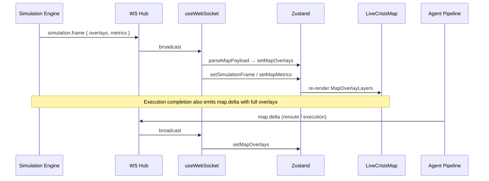

# CityBrain Live Crisis Mapping System

> Google Maps + WebSocket overlays + simulation-driven geometry for tactical ops.

---

## 1. Map architecture

```
┌──────────────────────────────────────────────────────────────────┐
│                     React Native (Expo)                          │
│  LiveCrisisMap ──► Native: react-native-maps (Google on Android) │
│                 └──► Web: Google Maps Embed + HUD overlay        │
├──────────────────────────────────────────────────────────────────┤
│  MapOverlayLayers (Polygon / Polyline / Circle / Marker)         │
│  MapLegend · Zustand mapOverlays + mapHotspots                   │
├──────────────────────────────────────────────────────────────────┤
│  useWebSocket ──► parseMapPayload() ──► setMapOverlays()         │
│  useCrisisDetail ──► centroid lat/lng from REST                │
└──────────────────────────────────────────────────────────────────┘
                              ▲
                              │ WSS map.delta | simulation.frame
┌──────────────────────────────────────────────────────────────────┐
│                     API (Node / Express)                         │
│  streamSimulationFrame() ──► overlays[] + metrics                │
│  buildMapDeltaPayload()  ──► execution / reroute snapshots       │
│  buildMapOverlays(world) ──► simulator tick geometry             │
└──────────────────────────────────────────────────────────────────┘
```

| Module | Path | Responsibility |
|--------|------|----------------|
| Overlay schema | `packages/shared/src/simulation.schema.ts` | `MapOverlay` geometry + style contract |
| State overlays | `services/api/src/map/state-overlays.ts` | Pipeline → overlays (execution, reroute) |
| Sim overlays | `services/api/src/simulator/overlays.ts` | Physics world → overlays per tick |
| WS streamer | `services/api/src/simulator/streamer.ts` | `simulation.frame` + `map.delta` fan-out |
| Parse layer | `apps/mobile/lib/map/parseMapPayload.ts` | Normalize WS + legacy payloads |
| Renderer | `apps/mobile/components/map/MapOverlayLayers.tsx` | Native map primitives |
| Screen | `apps/mobile/app/crisis/[id]/index.tsx` | Live Crisis Map tab |

---

## 2. Overlay system

### Overlay types

| Type | Geometry | Visual | Source |
|------|----------|--------|--------|
| `emergency_hotspot` | point | Red pulsing pin | Centroid / signals |
| `flood_zone` | circle | Blue fill, pulse when expanding | Simulator / flood crisis |
| `congestion_corridor` | polyline | Weight ∝ index, color by severity | Simulator + state |
| `reroute_path` | polyline (dashed) | Cyan detour | Traffic reroute agent |
| `rescue_unit` | point | Green/amber pin | Resources / sim units |
| `closed_road` | polyline | Red thick line | `road_blockage` scenarios |
| `alert_zone` | circle | Amber translucent ring | Citizen alert reach |

### Schema (`MapOverlay`)

```typescript
{
  id: string;
  type: OverlayType;
  label?: string;
  geometry: {
    kind: 'point' | 'polyline' | 'polygon' | 'circle';
    coordinates: GeoPoint[];
    radiusMeters?: number;  // circles only
  };
  style: { color, opacity, weight?, pulse? };
  metadata?: Record<string, unknown>;
}
```

### Z-order (bottom → top)

`alert_zone` → `flood_zone` → `congestion_corridor` → `closed_road` → `reroute_path` → `rescue_unit` → `emergency_hotspot`

Defined in `apps/mobile/lib/map/constants.ts` (`LAYER_Z_INDEX`).

---

## 3. Realtime update flow



**Update cadence**

- Simulation: one `map.delta` per `simulation.frame` (tick stream)
- Execution: `map.delta` on completion (before/after snapshots in DB)
- Traffic reroute: immediate `map.delta` when detour polyline applied
- Signals: `signal.new` → `mapHotspots` (point markers, no full overlay rebuild)

---

## 4. WebSocket sync

### Events

| Event | Payload keys | Store action |
|-------|----------------|--------------|
| `map.delta` | `overlays`, `metrics`, `centroid` | `setMapOverlays`, `setMapMetrics` |
| `simulation.frame` | Full `SimulationFrame` | Same as map.delta + `setSimulationFrame` |
| `simulation.tick` | `metrics`, `timelineEvent` | `setMapMetrics`, timeline |
| `signal.new` | `location`, `requiresImmediateAttention` | `addMapHotspot`, `addSignal` |

### Connection

- Single global socket in `app/_layout.tsx` via `useWebSocket()`
- Reconnect every 3s on disconnect
- `parseMapPayload()` supports typed overlays **and** legacy `{ routes, resources, floodZones }` shapes

### Backend emitters

```typescript
// Per simulation frame (streamer.ts)
broadcast({ type: 'simulation.frame', payload: frame });
broadcast({ type: 'map.delta', payload: { overlays: frame.overlays, units, metrics } });

// Execution / reroute (state-overlays.ts)
broadcast({ type: 'map.delta', payload: buildMapDeltaPayload(state, after) });
```

---

## 5. Simulation rendering

1. `createWorld(state)` seeds flood radius, congestion, rescue units, routes.
2. Each tick: physics models update world → `buildMapOverlays(world)`.
3. `streamSimulationFrame()` pushes frame to clients.
4. Mobile `MapOverlayLayers` renders:
   - **Flood**: `Circle` with pulse opacity toggle (900ms)
   - **Congestion**: `Polyline` width from `style.weight`
   - **Detour**: dashed `Polyline` (`lineDashPattern`)
   - **Rescue**: `Marker` pins at unit coordinates
   - **Hotspot**: centroid `Marker` at crisis epicenter

**Web fallback:** Google Maps Embed (satellite) + approximate flood ring HUD; layer count badge. Native builds get full geometry.

---

## 6. React Native implementation

### Key files

```
apps/mobile/
├── app/crisis/[id]/index.tsx          # Live Crisis Map screen
├── components/map/
│   ├── LiveCrisisMap.tsx              # Platform split (native / web)
│   ├── MapOverlayLayers.tsx           # Polygon, Polyline, Circle, Marker
│   └── MapLegend.tsx                  # Active layer chips
├── lib/map/
│   ├── types.ts
│   ├── constants.ts                   # colors, z-index, legend
│   └── parseMapPayload.ts             # WS normalization
├── hooks/useWebSocket.ts
└── lib/store.ts                       # mapOverlays, mapHotspots
```

### Google Maps setup

```bash
# .env (mobile)
EXPO_PUBLIC_GOOGLE_MAPS_API_KEY=your_key
```

- **Android:** `react-native-maps` with `PROVIDER_GOOGLE`
- **iOS:** Apple Maps default (Google optional via config)
- **Web:** Maps Embed API v1 view (satellite)

### Env / run

```bash
cd citybrain/apps/mobile
npx expo start
```

Open crisis → **MAP** tab during `g10_flood` demo to see flood circle, congestion corridor, rescue pins, and detour paths update live.

---

## Extension hooks

- REST `GET /crises/:id/simulation` — hydrate initial overlays from last run
- `heatmap` overlay type — density grid from signal clusters
- Google Maps JS API on web for true polygon overlay parity with native
