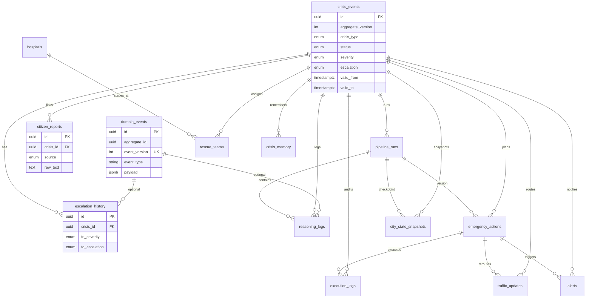

# CityBrain AI — Database Architecture

> **Engine:** PostgreSQL 16 + `pgvector` + `uuid-ossp`  
> **Pattern:** Event sourcing (append-only) + relational projections + temporal audit  
> **Migrations:** [`infra/migrations/`](../infra/migrations/)

---

## 1. Architecture Rationale

### Why event sourcing + projections?

City emergencies are **long-running, stateful, and auditable**. Judges and operators must answer: *who decided what, when, and why?* An append-only `domain_events` table provides:

- Immutable audit trail (replay for demos/legal review)
- Rebuild of `crisis_events` projection after bug fixes
- Correlation across agents (`correlation_id`) and causation chains (`causation_id`)

`crisis_events` is the **read-optimized projection** (current crisis board). Writes go: **command → domain_events → update projection**.

### Why temporal tracking?

Crises evolve: `watch → operational → critical`, severity bumps, replans. We track:

| Mechanism | Purpose |
|-----------|---------|
| `crisis_events.valid_from / valid_to` | Business-time version of projection (replan) |
| `crisis_events.opened_at / closed_at` | Incident lifecycle |
| `escalation_history` | **Immutable** severity/escalation ladder changes |
| `traffic_updates.effective_from / effective_to` | Route overrides time window |
| `crisis_memory.valid_from / valid_to` | Memory supersession |

### Why separate tables (not JSON blobs only)?

| Table | Reason |
|-------|--------|
| `citizen_reports` | High-volume ingest, geo queries, link later to crisis |
| `reasoning_logs` | Agent audit, indexed by agent_name |
| `emergency_actions` | Plan execution state machine |
| `execution_logs` | Tool-level forensics (separate from business actions) |
| `hospitals` / `rescue_teams` | Reference + dispatch assignment |
| `escalation_history` | Severity evolution without parsing JSON |

### Scalability path

| Phase | Strategy |
|-------|----------|
| Hackathon | Single Postgres, ~11 core tables, B-tree indexes |
| Growth | Partition `domain_events` + `citizen_reports` by month |
| Search | HNSW on `crisis_memory.embedding` |
| Read scale | Read replicas for dashboard; writer on primary |

---

## 2. Table Relationships (ER)



### Cardinality summary

| Parent | Child | Relationship |
|--------|-------|--------------|
| `crisis_events` | `citizen_reports` | 1:N (reports may exist before crisis linked) |
| `crisis_events` | `escalation_history` | 1:N (timeline) |
| `crisis_events` | `pipeline_runs` | 1:N (replan = new run) |
| `pipeline_runs` | `reasoning_logs` | 1:N (9 agents per run) |
| `crisis_events` | `emergency_actions` | 1:N |
| `emergency_actions` | `execution_logs` | 1:N |
| `emergency_actions` | `traffic_updates` | 1:0..1 |
| `emergency_actions` | `alerts` | 1:0..1 |
| `hospitals` | `rescue_teams` | 1:N (optional staging) |

---

## 3. Event Sourcing Model

### Append flow

```
1. INSERT domain_events (event_version = MAX+1)
2. UPDATE crisis_events SET aggregate_version = event_version, ...
3. INSERT escalation_history (if EscalationChanged)
4. INSERT reasoning_logs / emergency_actions (projections)
```

### Helper function

```sql
SELECT append_domain_event(
  'crisis',
  :crisis_id,
  'CrisisSeverityRaised',
  '{"from":"high","to":"critical"}'::jsonb,
  :correlation_id
);
```

### Standard event types

| event_type | Projection effect |
|------------|-------------------|
| `CrisisOpened` | INSERT `crisis_events` |
| `ReportIngested` | INSERT `citizen_reports` |
| `SeverityAssessed` | UPDATE severity + INSERT `escalation_history` |
| `PlanCreated` | INSERT `emergency_actions` (draft) |
| `ActionExecuted` | UPDATE action status + INSERT `execution_logs` |
| `TrafficRerouted` | INSERT `traffic_updates` |
| `AlertIssued` | INSERT `alerts` |
| `TeamDispatched` | UPDATE `rescue_teams` |
| `ReflectionCompleted` | INSERT `crisis_memory` |
| `CrisisResolved` | UPDATE status, `closed_at` |

### Replay (rebuild projection)

```sql
-- Pseudocode: truncate projection, replay ordered events
SELECT * FROM domain_events
WHERE aggregate_id = :id
ORDER BY event_version ASC;
-- Apply each event_type handler in application code
```

---

## 4. Severity Evolution Tracking

`escalation_history` captures every ladder change:

```sql
INSERT INTO escalation_history (
  crisis_id, from_severity, to_severity,
  from_escalation, to_escalation,
  reason, triggered_by, factors, domain_event_id
) VALUES (...);
```

**Query: severity timeline for dossier UI**

```sql
SELECT recorded_at, from_severity, to_severity, to_escalation, reason
FROM escalation_history
WHERE crisis_id = $1
ORDER BY recorded_at ASC;
```

**Query: current severity** — read from `crisis_events.severity` (denormalized for speed).

---

## 5. Indexes (summary)

| Index | Table | Query pattern |
|-------|-------|---------------|
| `idx_domain_events_aggregate` | domain_events | Replay / stream |
| `idx_crisis_events_status_opened` | crisis_events | Active crises board |
| `idx_escalation_history_crisis_time` | escalation_history | Timeline |
| `idx_citizen_reports_ingested` | citizen_reports | Live signal feed |
| `idx_reasoning_logs_crisis_agent` | reasoning_logs | Agent trace UI |
| `idx_emergency_actions_crisis_status` | emergency_actions | Execution queue |
| `idx_execution_logs_crisis_time` | execution_logs | Audit log |
| `idx_crisis_memory_type_area` | crisis_memory | Recall by type |
| HNSW (deferred) | crisis_memory.embedding | Similarity search |

Full definitions: [`002_v2_schema.sql`](../infra/migrations/002_v2_schema.sql).

---

## 6. Migrations

| File | Purpose |
|------|---------|
| `001_init.sql` | MVP schema (legacy — `crises`, `signals`, …) |
| `002_v2_schema.sql` | **Canonical v2** — all requested tables + event store |
| `003_v2_seed_reference.sql` | Islamabad hospitals + rescue teams |
| `004_v1_compat_views.sql` | Optional views (commented) for dual-run migration |

### Apply order

```bash
# Fresh database (Docker init runs all in order)
psql $DATABASE_URL -f infra/migrations/001_init.sql
psql $DATABASE_URL -f infra/migrations/002_v2_schema.sql
psql $DATABASE_URL -f infra/migrations/003_v2_seed_reference.sql
```

### v1 → v2 mapping

| v1 (001) | v2 (002) |
|----------|----------|
| `crises` | `crisis_events` |
| `signals` | `citizen_reports` |
| `actions` | `emergency_actions` |
| `reasoning_traces` + `agent_runs` | `reasoning_logs` + `pipeline_runs` |
| `route_overrides` | `traffic_updates` |
| `resources` | `rescue_teams` |
| `alerts` | `alerts` (expanded columns) |
| `crisis_memory` | `crisis_memory` (temporal columns) |
| — | `domain_events`, `escalation_history`, `hospitals` |

---

## 7. Prisma

- **Schema:** [`backend/database/prisma/schema.prisma`](../backend/database/prisma/schema.prisma)
- **Generate client:**

```bash
cd backend/database
npm install prisma @prisma/client --save-dev
npx prisma generate
```

- **Note:** `crisis_memory.embedding` is `vector(384)` — use `$queryRaw` for similarity:

```typescript
const similar = await prisma.$queryRaw`
  SELECT id, summary, 1 - (embedding <=> ${vector}::vector) AS score
  FROM crisis_memory
  WHERE crisis_type = 'flood'
  ORDER BY embedding <=> ${vector}::vector
  LIMIT 5
`;
```

---

## 8. Sample Queries

### Active crises (ops board)

```sql
SELECT id, title, crisis_type, escalation, severity, confidence, opened_at
FROM crisis_events
WHERE status NOT IN ('resolved', 'archived', 'failed')
ORDER BY
  CASE escalation
    WHEN 'critical' THEN 1
    WHEN 'operational' THEN 2
    WHEN 'advisory' THEN 3
    ELSE 4
  END,
  opened_at DESC;
```

### Full crisis dossier

```sql
-- Crisis + reports + escalation timeline + latest plan
SELECT ce.*,
  (SELECT json_agg(cr ORDER BY ingested_at)
   FROM citizen_reports cr WHERE cr.crisis_id = ce.id) AS reports,
  (SELECT json_agg(eh ORDER BY recorded_at)
   FROM escalation_history eh WHERE eh.crisis_id = ce.id) AS escalation_timeline
FROM crisis_events ce
WHERE ce.id = $1;
```

### Agent trace

```sql
SELECT agent_name, thought, latency_ms, output_json, created_at
FROM reasoning_logs
WHERE crisis_id = $1
ORDER BY created_at ASC;
```

---

## 9. Data Integrity Rules

| Rule | Enforcement |
|------|-------------|
| Event versions monotonic | `UNIQUE (aggregate_type, aggregate_id, event_version)` |
| Confidence 0–1 | `CHECK` on reports + crisis |
| Action priority 1–10 | `CHECK` on emergency_actions |
| Idempotent actions | `UNIQUE (crisis_id, idempotency_key)` |
| Cascade delete crisis | `ON DELETE CASCADE` on child facts |
| Preserve audit events | `domain_events` never updated/deleted in app layer |

---

*Schema version: 2.0 — aligns with [`BACKEND_ARCHITECTURE.md`](./BACKEND_ARCHITECTURE.md)*
